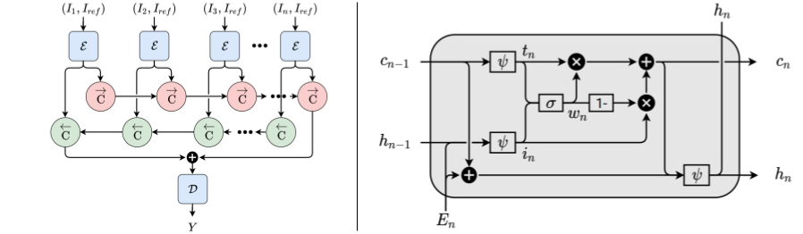

# Few-shot Deep HDR Deghosting
This repository contains code and pretrained models for our paper: [Self-Gated Memory Recurrent Network for Efficient Scalable HDR Deghosting](https://ieeexplore.ieee.org/stamp/stamp.jsp?tp=&arnumber=9540317&tag=1) accepted to IEEE Transactions on Computational Imaging.

It has been tested on RTX 6000 with Tensorflow 2.3.4.




## Installation and Setup
### Docker Environment:
Getting base image:
```shell script
$ docker pull tensorflow/tensorflow:2.3.4-gpu
```

Running base image:
```shell script
$ docker run --rm -it tensorflow/tensorflow:2.3.4-gpu bash
```

Installing dependencies:
```shell script
(docker)# apt update
(docker)# apt install -y ffmpeg libsm6 libxext6 libxrender-dev
(docker)# pip install opencv-python
```

### Datasets:
The Kalantari dataset (SIG17) can be downloaded [here](https://www.kaggle.com/valrnn/Kalantari17), and the Prabhakar dataset (ICCP19) can be downloaded [here](https://www.kaggle.com/valrnn/ICCP19).

Download the required dataset and extract it in the `dataset` folder.

### Training
To view all training options, run

```shell
$ python main.py --help
```

To train a Bidirectional SGM model with the default configuration, run

```shell
$ python main.py --rtx
```

### Inference
To evaluate the pretrained model on the Kalantari17 dataset, run

```shell
$ python val.py --rtx --weights pretrained_weights/UCSD/bidirectional.sgm/bidirectional.sgm.tf
```

## Citation
When citing this work, you should use the following Bibtex:

    @ARTICLE{9540317, 
        author={Kathirvel, Ram Prabhakar and Agrawal, Susmit and Radhakrishnan, Venkatesh Babu},
        journal={IEEE Transactions on Computational Imaging}, 
        title={Self-Gated Memory Recurrent Network for Efficient Scalable HDR Deghosting}, 
        year={2021},
        volume={},
        number={},
        pages={1-1},
        doi={10.1109/TCI.2021.3112920}
    }